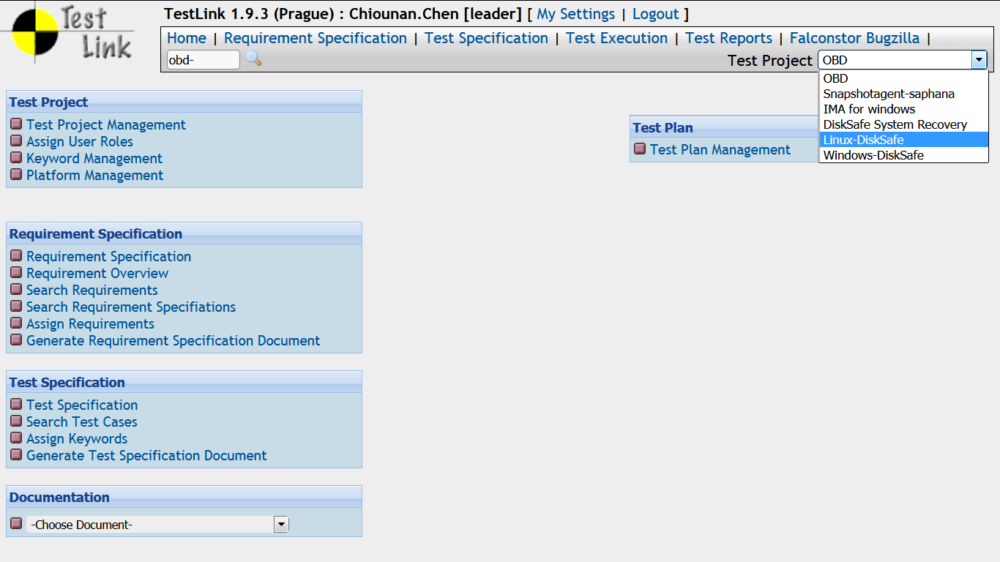
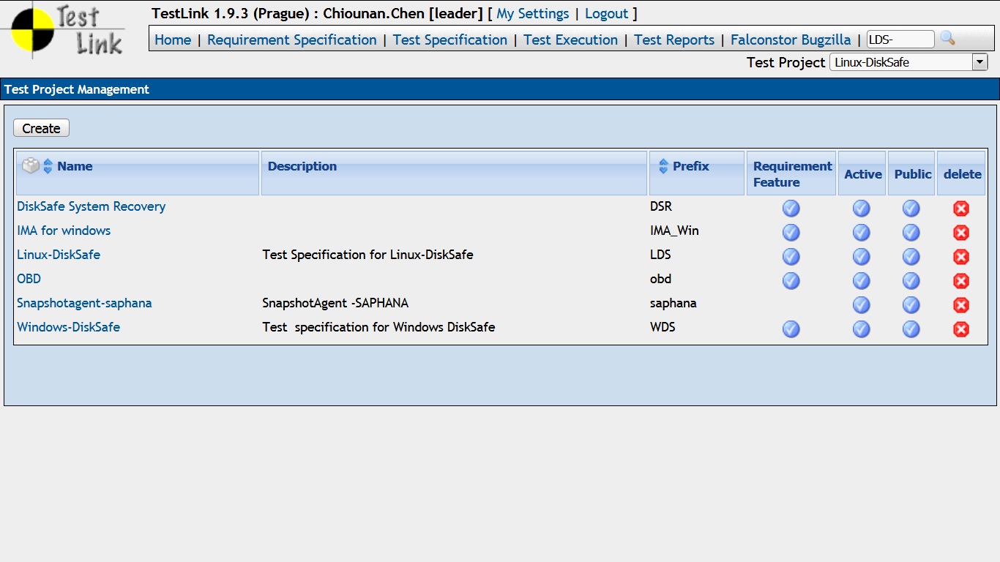

# Test Plan and Test Case

## Test Strategy
- White-Box Test
  - Integration Test
- Black-Box Test
  - System Test
    - Function Test
      - Boundary Test
      - Scenario Test
  - User Acceptance Test
    - Usabiliby Test
  - Regression Test
    - Bug verification
    - Change log verification
    - Sanity Check

## What is Test Case for?
- To validate the expected results.
- To reproduce the problem.

## Type of Test Cases
- Boundary Test
  - Test if wrong user input and data cause problem.
  - Example:
    - Buffer overflow.
    - date/time range
    - special character

- Function Test
  - Test if software’s function is the same as documents __(requirement or specification)__.
  - Design function test case:
    - Test if function is satisfied by demand.
    - Test if function is complete.
    - Test if function works.
    - Test if function have error.

- Configuration Test
- Stage Test
- Stress Test
- Error Handling Test
- Regression Test

- Test Plan template

# TestLink

- TestLink: Test Project

- TestLink: Test Project Management

- TestLink: Add Test Cases to Test Plan

- TestLink: Test Plan Management

- TestLink: Test Case specification

- TestLink: Current Test Plan

- TestLink: Assign Testers to test execution

- TestLink: Test Case execution and results

- TestLink: Reports

- TestLink: Online demo

[Bitnami](https://bitnami.com/stack/testlink)

